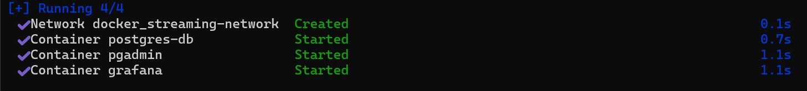
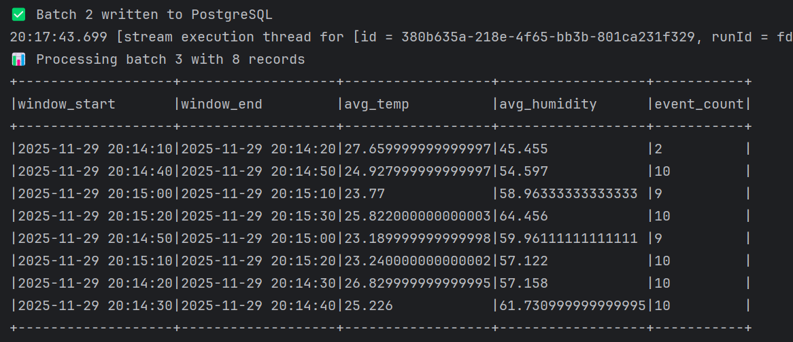
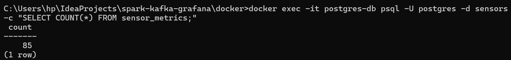
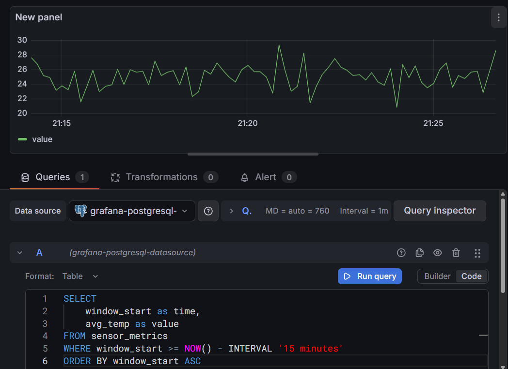

#  **Realtime sensor pipeline**

[](https://www.scala-lang.org/)
[](https://spark.apache.org/)
[](https://kafka.apache.org/)
[](https://www.postgresql.org/)

##  Overview

A **production-ready real-time streaming pipeline** that demonstrates end-to-end data flow:

🔹 **Kafka** - Event ingestion and message queuing  
🔹 **Apache Spark Structured Streaming** - Real-time data processing with windowed aggregations  
🔹 **PostgreSQL** - Time-series data storage  
🔹 **Grafana** - Live dashboarding and visualization  

This project processes IoT sensor data (temperature & humidity) in real-time, computes 10-second window aggregations, and visualizes metrics on a live dashboard.

**Built for Windows 11** with local Kafka & Spark installations.

---

##  **Features**

Real-time stream processing with Apache Spark  
Windowed aggregations (10-second tumbling windows)  
Fault-tolerant with Kafka buffering & Spark checkpointing  
Time-series data storage in PostgreSQL  
Live Grafana dashboards with auto-refresh  
Scalable architecture ready for production  

---

## **Screenshots**

### Docker PostgreSQL Setup


### Kafka Topic Creation


### Spark Processing Batches


### Data Verification in PostgreSQL


### Grafana Dashboard


---

#  **Project Structure**

```
spark-kafka-grafana/
│
├── build.sbt
├── project/
│   └── plugins.sbt
│
├── src/
│   ├── main/
│   │   ├── scala/
│   │   │   ├── StreamingJob.scala
│   │   │   └── models/
│   │   │       └── SensorEvent.scala
│   │   └── resources/
│   │       ├── application.conf
│   │       └── log4j2.xml
│   │
│   └── test/
│       └── scala/
│           └── StreamingJobSpec.scala
│
├── docker/
│   ├── docker-compose.yml
│   └── postgres/
│       └── init.sql
│
├── scripts/
│   ├── kafka_producer.py          # Python data generator
│   └── kafka_producer_scala.scala # Scala producer alternative
│
├── grafana/
│   ├── dashboard.json              # Complete Grafana dashboard
│   └── queries.sql                 # SQL queries for panels
│
└── README.md
```

---

## **Quick Start**

### Prerequisites
- **Kafka** installed locally (or use Docker Redpanda)
- **Apache Spark 3.5.x** installed locally
- **Java 11 or 17**
- **SBT** (Scala Build Tool)
- **Docker Desktop** (for PostgreSQL)
- **Python 3.8+** (optional, for Python producer)

### Step 1: Start Kafka
```powershell
# Start Zookeeper
<KAFKA_DIR>\bin\windows\zookeeper-server-start.bat <KAFKA_DIR>\config\zookeeper.properties

# Start Kafka (new terminal)
<KAFKA_DIR>\bin\windows\kafka-server-start.bat <KAFKA_DIR>\config\server.properties

# Create topic
<KAFKA_DIR>\bin\windows\kafka-topics.bat --create --topic sensor-events --bootstrap-server localhost:9092 --partitions 3 --replication-factor 1
```

---

### Step 2: Start PostgreSQL
```powershell
cd docker
docker-compose up -d postgres grafana
```

### Step 3: Build & Run Spark
```powershell
# Build
sbt clean compile package

# Run Spark Streaming Job
spark-submit --class StreamingJob --master local[*] --packages org.apache.spark:spark-sql-kafka-0-10_2.12:3.5.1,org.postgresql:postgresql:42.7.1 target\scala-2.12\spark-kafka-streaming_2.12-0.1.0-SNAPSHOT.jar
```

### Step 4: Generate Data
```powershell
# Install dependency
py -m pip install kafka-python

# Run producer
py scripts\kafka_producer.py
```

### Step 5: View Dashboard
1. Open Grafana: http://localhost:3000 (admin/admin)
2. Add PostgreSQL data source (host: `postgres-db:5432`)
3. Import dashboard from `grafana/dashboard.json`
4. Watch live data flowing! 📊

---

## **Data Flow**

```
Python Producer (1 event/sec)
    ↓
Kafka Topic (sensor-events)
    ↓
Spark Streaming (10s windows)
    ↓
PostgreSQL (sensor_metrics)
    ↓
Grafana Dashboard (5s refresh)
```

## **Dashboard Panels**

The Grafana dashboard includes:
- **Current Temperature Gauge** - Real-time avg temperature
- **Current Humidity Gauge** - Real-time avg humidity  
- **Temperature Time Series** - Temperature trends over time
- **Humidity Time Series** - Humidity trends over time
- **Event Count Chart** - Events processed per window
- **Recent Metrics Table** - Latest aggregated data

---

## **Database Schema**

```sql
CREATE TABLE sensor_metrics (
    id SERIAL PRIMARY KEY,
    window_start TIMESTAMP NOT NULL,
    window_end TIMESTAMP NOT NULL,
    avg_temp DOUBLE PRECISION,
    avg_humidity DOUBLE PRECISION,
    event_count BIGINT,
    created_at TIMESTAMP DEFAULT CURRENT_TIMESTAMP
);
```

---

## **Verify Data**

```powershell
# Check Kafka messages
docker exec -it <kafka-container> kafka-console-consumer --bootstrap-server localhost:9092 --topic sensor-events

# Check PostgreSQL data
docker exec -it postgres-db psql -U postgres -d sensors -c "SELECT COUNT(*) FROM sensor_metrics;"
```

---

## **What You'll Learn**

Apache Spark Structured Streaming  
Kafka message streaming & topic management  
Time-windowed aggregations  
JDBC integration with Spark  
Docker Compose orchestration  
Real-time dashboarding with Grafana  
Scala programming for big data  
Production-ready streaming architecture  

---

## **Technologies Used**

| Component | Technology | Version |
|-----------|------------|---------|
| Stream Processing | Apache Spark | 3.5.1 |
| Message Queue | Kafka | 3.4+ |
| Database | PostgreSQL | 16 |
| Visualization | Grafana | Latest |
| Language | Scala | 2.12.18 |
| Build Tool | SBT | Latest |
| Containers | Docker | Latest |

---

## **Use Cases**

Perfect for:
- Learning real-time streaming systems
- Portfolio/resume projects
- Technical interview demonstrations
- Production streaming pipelines
- IoT sensor data monitoring
- Real-time analytics dashboards

---

## **Future Enhancements**

- [ ] Add machine learning anomaly detection
- [ ] Implement Grafana alerting (email/Slack)
- [ ] Add REST API for metric queries
- [ ] Deploy to cloud (AWS/Azure/GCP)
- [ ] Add authentication & security
- [ ] Integrate real IoT sensors via MQTT
- [ ] Add data quality monitoring
- [ ] Implement data retention policies

---

## **Documentation**

- **LOCAL_SETUP_GUIDE.md** - Detailed setup for local Kafka/Spark
- **TROUBLESHOOTING.md** - Common issues and solutions
- **ARCHITECTURE.md** - System design and data flow diagrams

---

## **Contributing**

Contributions are welcome! Feel free to open issues or submit pull requests.

---

## **License**

This project is open source and available for educational purposes.

---

## **Tips**

- Monitor Spark UI at http://localhost:4040 for job metrics
- Use pgAdmin at http://localhost:5050 for database management
- Adjust window duration in `StreamingJob.scala` for different aggregation periods
- Change Grafana refresh rate based on your needs (default: 5 seconds)

---

**Built with ❤️ for learning real-time data streaming**